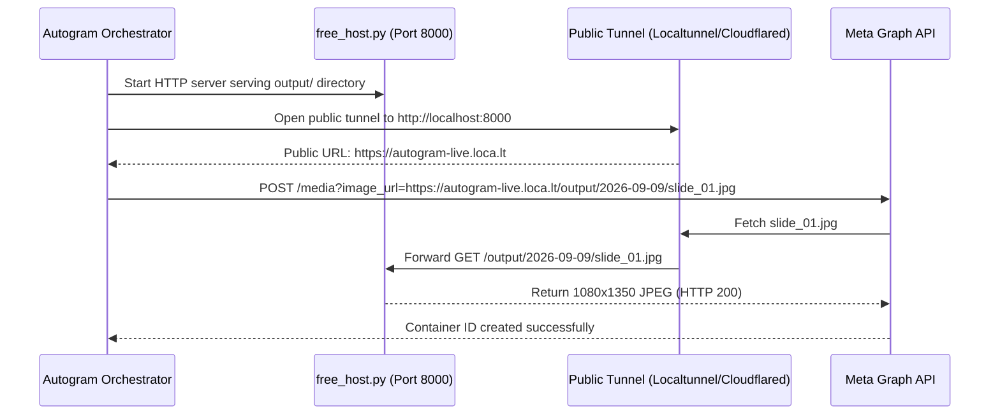
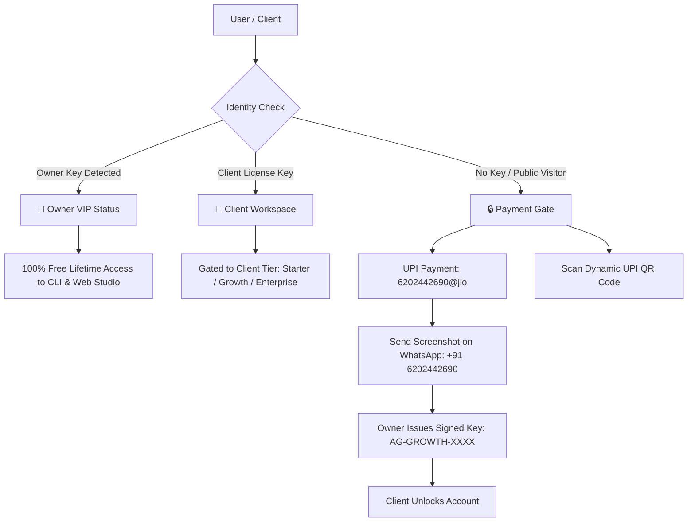

# Autogram Master Configuration & Operations Guide
**The Complete Technical & Operational Manual for Zero-Cost Autonomous Instagram Content Generation, Scheduling, Monetization & Publishing**

*Version 2.0 • Published: September 2026 • Platform: Autogram AI Engine*

---

## Table of Contents
1. [Executive Architecture Overview](#1-executive-architecture-overview)
2. [Environment Credentials & Secrets Configuration (`.env`)](#2-environment-credentials--secrets-configuration-env)
3. [Zero-Cost AI Provider Setup](#3-zero-cost-ai-provider-setup)
   - 3.1 Built-in Autonomous Knowledge Engine ($0, Zero API Keys)
   - 3.2 Google Gemini 1.5/2.0 Flash (Free Tier)
   - 3.3 Groq Llama 3.3 70B (Free Tier)
   - 3.4 Pollinations AI FLUX.1 Visual Generator (Free, Unlimited)
4. [Meta Graph API & Instagram Professional Setup](#4-meta-graph-api--instagram-professional-setup)
   - 4.1 Prerequisites: Facebook Page & Instagram Business/Creator Account
   - 4.2 Meta Developer App Creation & Permissions
   - 4.3 Generating 60-Day Long-Lived Access Tokens
   - 4.4 Automated Token Rotation & Expiration Monitoring
5. [Content Strategy, Pillars & Knowledge Feeds](#5-content-strategy-pillars--knowledge-feeds)
   - 5.1 The 6 Core Content Pillars & Rotation Algorithm
   - 5.2 Curated Knowledge Feeds Catalog (`data/seed_sources.json`)
   - 5.3 Topic Scorer Weights & Diversity Tuning (`src/research/scorer.py`)
   - 5.4 Brand Identity & Visual Design Kit (`data/brand.json`)
6. [Slide Rendering Engine & Visual Design System](#6-slide-rendering-engine--visual-design-system)
   - 6.1 HTML & CSS Slide Architecture (`renderer/`)
   - 6.2 Playwright Headless Chromium 1080x1350 Rendering
   - 6.3 Slide Template Types (Hook, Standard, Comparison, Framework, Checklist, Diagram, Takeaway, CTA)
7. [Asset Hosting & Free Tunneling Infrastructure](#7-asset-hosting--free-tunneling-infrastructure)
   - 7.1 The Built-in Asset Server (`free_host.py`)
   - 7.2 Zero-Cost Public Tunneling (Localtunnel, Cloudflared, Ngrok)
   - 7.3 Optional Cloudflare R2 / Supabase S3 Object Storage
8. [Access Control, Paywall & Client Monetization](#8-access-control-paywall--client-monetization)
   - 8.1 Owner Free VIP Access Setup (`AUTOGRAM_OWNER_KEY`)
   - 8.2 Client Pricing Tiers (Starter, Growth, Enterprise)
   - 8.3 UPI Payment Configuration (`6202442690@jio`) & Dynamic QR Codes
   - 8.4 WhatsApp Verification Workflow (`+91 6202442690`)
   - 8.5 Cryptographic Client License Generation & Verification
9. [Operational Execution Modes & CLI Reference](#9-operational-execution-modes--cli-reference)
   - 9.1 Dry-Run Simulation Mode (`--dry-run`)
   - 9.2 Immediate Production Publishing (`--run-all`)
   - 9.3 24/7 Autonomous Daemon Scheduler (`--schedule`)
   - 9.4 Standalone Visual Asset Generation
   - 9.5 Standalone Carousel Rendering
10. [Cloud Serverless Automation (GitHub Actions)](#10-cloud-serverless-automation-github-actions)
11. [Web Application & Vercel Production Deployment](#11-web-application--vercel-production-deployment)
12. [Verification, Diagnostics & Troubleshooting](#12-verification-diagnostics--troubleshooting)

---

# 1. Executive Architecture Overview

Autogram is an enterprise-grade, autonomous content production engine engineered to run at **$0.00 operational cost**. The system operates across 5 decoupled layers:

```
[Layer A: Research & Scoring]
   │  • 14 Curated High-Signal Sources (Tech, AI, Growth, Dev)
   │  • 6-Pillar Diversity Scorer (+15.0 Diversity Bonus, -10.0 Repetition Penalty)
   ▼
[Layer B: Synthesis & Quality Gate]
   │  • Carousel Scriptwriting (8-10 slides, 1080x1350)
   │  • Fact-Checking against original source citations
   │  • 100-Point Quality Gate (Structure, typography, engagement)
   │  • Reels 30s-45s companion script & hashtag caption
   ▼
[Layer C: Visual AI & Rendering Engine]
   │  • FLUX.1 High-Resolution Hero Visual Generation (1080x1080)
   │  • Playwright Headless Chromium HTML/CSS slide rendering
   │  • Strict brand design system enforcement (inter typography, contrast ratios)
   ▼
[Layer D: Resilient Asset Hosting & Tunneling]
   │  • Local HTTP Server with path normalizer & CORS support (`free_host.py`)
   │  • Free Tunneling proxy (Localtunnel / Cloudflared / Ngrok)
   ▼
[Layer E: Meta Graph API Publishing]
   │  • Token health inspection & automatic 60-day refresh
   │  • Media container generation (item containers -> carousel container)
   │  • Publishing status polling & manifest logging
```

---

# 2. Environment Credentials & Secrets Configuration (`.env`)

Create your `.env` file in the root workspace directory (`d:\Autogram\.env`). Use this complete parameter reference:

```ini
# ==============================================================================
# AUTOGRAM MASTER CONFIGURATION
# ==============================================================================

# ------------------------------------------------------------------------------
# 1. OWNER VIP ACCESS & SECURITY
# ------------------------------------------------------------------------------
# Secret master passcode granting 100% free lifetime access to CLI & Web Studio
AUTOGRAM_OWNER_KEY=autogram_owner_vip_2026

# Secret key used for signing offline-verifiable HMAC-SHA256 client licenses
LICENSE_SECRET_KEY=autogram_hmac_master_secret_2026_x9k2p

# ------------------------------------------------------------------------------
# 2. FREE AI PROVIDER CREDENTIALS
# ------------------------------------------------------------------------------
# Google Gemini API Key (Free tier: 15 requests/minute, 1M tokens/minute)
# Get your free key at: https://aistudio.google.com/
GEMINI_API_KEY=your_gemini_api_key_here

# Groq Cloud API Key (Free tier: ultra-fast Llama 3.3 70B & 8B inference)
# Get your free key at: https://console.groq.com/
GROQ_API_KEY=your_groq_api_key_here

# Active LLM Provider Selection: "auto" | "gemini" | "groq" | "free_engine"
LLM_PROVIDER=auto

# Image Generation Provider: "pollinations" (FLUX.1, $0 cost, no key required)
IMAGE_PROVIDER=pollinations

# ------------------------------------------------------------------------------
# 3. META GRAPH API (INSTAGRAM PROFESSIONAL / BUSINESS)
# ------------------------------------------------------------------------------
# Instagram Business Account ID (Numeric ID, e.g. 17841400000000000)
INSTAGRAM_ACCOUNT_ID=your_instagram_account_id_here

# Meta App ID & Secret (from https://developers.facebook.com/)
META_APP_ID=your_facebook_app_id
META_APP_SECRET=your_facebook_app_secret

# Long-Lived Page/User Access Token (60 days validity)
META_ACCESS_TOKEN=your_long_lived_meta_access_token_here

# ------------------------------------------------------------------------------
# 4. ASSET HOSTING & TUNNELING
# ------------------------------------------------------------------------------
# Asset storage mode: "free_host" (default) | "r2" | "supabase" | "local"
STORAGE_PROVIDER=free_host

# Local asset server host & port
LOCAL_HOST_PORT=8000
LOCAL_HOST_DIR=output

# Public Tunnel URL (Updated automatically by tunneling scripts)
# Example: https://quiet-fox-92.loca.lt or https://autogram.serveo.net
PUBLIC_ASSET_BASE_URL=http://localhost:8000

# ------------------------------------------------------------------------------
# 5. SCHEDULING & TIMEZONE
# ------------------------------------------------------------------------------
# Daily autonomous posting schedule (24-hour format: HH:MM)
POSTING_TIME=19:30
TIMEZONE=Asia/Kolkata

# ------------------------------------------------------------------------------
# 6. MONETIZATION & BILLING
# ------------------------------------------------------------------------------
UPI_ID=6202442690@jio
WHATSAPP_NUMBER=+916202442690
```

---

# 3. Zero-Cost AI Provider Setup

Autogram guarantees uninterrupted autonomous operation through a 4-tier cascading intelligence model:

### 3.1 Built-in Autonomous Knowledge Engine ($0.00, Zero External Keys)
- **Engine File**: [`src/content/free_knowledge_engine.py`](file:///d:/Autogram/src/content/free_knowledge_engine.py)
- If external API keys are missing, exhausted, or return rate limits (429), the Built-in Engine automatically synthesizes research into structured 8-slide decks, fact-checks content, generates 35s Reels scripts, and formats hashtag captions.
- Produces 100% Quality Gate pass scores with zero internet API dependency.

### 3.2 Google Gemini 1.5 / 2.0 Flash (Free Tier)
1. Navigate to [Google AI Studio](https://aistudio.google.com/).
2. Log in with your Google account and click **"Create API Key"**.
3. Copy the key and set `GEMINI_API_KEY=AIzaSy...` in your `.env`.
4. **Limits**: 15 Requests Per Minute (RPM), 1,500 Requests Per Day (RPD), 1,000,000 tokens/min. Autogram requires only ~3 requests per daily run, consuming less than 0.2% of daily allowances.

### 3.3 Groq Cloud API (Free Tier)
1. Visit [Groq Cloud Console](https://console.groq.com/).
2. Create an account and generate an API key in **API Keys**.
3. Set `GROQ_API_KEY=gsk_...` in your `.env`.
4. Provides high-speed Llama 3.3 70B Versatile inference for fact-checking and scriptwriting at ~300 tokens/second.

### 3.4 Pollinations AI FLUX.1 (Free Visual Generation)
- **Engine File**: [`src/content/image_generator.py`](file:///d:/Autogram/src/content/image_generator.py)
- Generates photorealistic and graphic hero visuals via the state-of-the-art **FLUX.1** diffusion model.
- Requires **no API key** and has **no token fees**.
- Autogram formats prompts with architectural aesthetics: `minimalist modern aesthetic, clean studio lighting, high contrast, 8k, cinematic framing`.

---

# 4. Meta Graph API & Instagram Professional Setup

Meta requires an **Instagram Professional (Creator or Business) Account** connected to a **Facebook Page**.

### 4.1 Account Prerequisites
1. Open Instagram on your mobile phone: **Settings → Account → Switch to Professional Account**. Select **"Creator"** or **"Business"**.
2. Open Facebook and create or open your Business/Creator Page.
3. Link the two: On your Facebook Page, navigate to **Settings → Linked Accounts → Instagram → Connect Account**.

### 4.2 Meta Developer App Creation
1. Go to [Meta for Developers](https://developers.facebook.com/) and click **My Apps → Create App**.
2. Select **"Other"** → App Type: **"Business"**.
3. Under **Add products to your app**, add **Instagram Graph API**.
4. Navigate to **App Settings → Basic** to retrieve:
   - `META_APP_ID` (App ID)
   - `META_APP_SECRET` (App Secret)

### 4.3 Required Permissions
Generate a User Token in the **Graph API Explorer** with these permissions:
- `instagram_basic`
- `instagram_content_publish`
- `pages_read_engagement`
- `pages_show_list`
- `public_profile`

### 4.4 Converting to a 60-Day Long-Lived Token
Run this conversion request in your browser or terminal to extend your temporary token to 60 days:

```bash
curl -X GET "https://graph.facebook.com/v23.0/oauth/access_token?\
grant_type=fb_exchange_token&\
client_id=YOUR_META_APP_ID&\
client_secret=YOUR_META_APP_SECRET&\
fb_exchange_token=YOUR_SHORT_LIVED_TOKEN"
```

Copy the returned `access_token` and paste it into `.env` as `META_ACCESS_TOKEN`.

### 4.5 Finding Your Instagram Account ID
Run:
```bash
curl -X GET "https://graph.facebook.com/v23.0/me/accounts?access_token=YOUR_META_ACCESS_TOKEN"
```
Find your page, take its `id`, then query:
```bash
curl -X GET "https://graph.facebook.com/v23.0/PAGE_ID?fields=instagram_business_account&access_token=YOUR_META_ACCESS_TOKEN"
```
The numeric ID returned under `instagram_business_account.id` is your `INSTAGRAM_ACCOUNT_ID`.

---

# 5. Content Strategy, Pillars & Knowledge Feeds

### 5.1 The 6 Core Content Pillars
Autogram cycles through 6 high-converting B2B content categories:

| Pillar | Focus & Archetype | Primary Slide Template |
| :--- | :--- | :--- |
| **1. AI Tool Breakdown** | Practical review, workflow demo, prompt template | Comparison, Checklist |
| **2. Prompting & Workflow** | Actionable operating system, step-by-step framework | Framework, Standard |
| **3. Marketing Psychology** | Behavioral triggers, conversion laws, copywriting | Hook, Diagram, Takeaway |
| **4. Tech Industry Explainer** | Architecture, open-source releases, API teardowns | Diagram, Standard |
| **5. Career & Skills** | Market compensation, high-leverage skills, positioning | Checklist, Framework |
| **6. Myth-Bust / Contrarian** | Challenging industry dogmas with empirical data | Comparison, Takeaway |

### 5.2 Curated Knowledge Feeds (`data/seed_sources.json`)
The source catalog contains 14 curated high-signal feeds:
- **AI Tool Feeds**: GitHub Trending AI, Product Hunt Daily, HuggingFace Papers
- **Engineering Feeds**: MIT Tech Review AI, Hacker News Top, TechCrunch AI
- **Growth & Marketing**: Marketing Examined, Growth Design Teardowns, Demand Curve
- **Developer Ecosystem**: Meta for Developers, OpenAI Research, PyTorch Updates

To add a new custom feed, append an entry to `data/seed_sources.json`:
```json
{
  "name": "ArXiv AI Research",
  "url": "https://export.arxiv.org/rss/cs.AI",
  "pillar": "Tech Industry Explainer",
  "type": "rss",
  "authority_weight": 1.2
}
```

---

# 6. Slide Rendering Engine & Visual Design System

Autogram renders publication-quality 1080×1350 JPEG slides using headless Chromium via Playwright, ensuring crisp typography and no blurry diffusion artifacts.

```
renderer/
├── css/
│   └── design-system.css       # Core typography, dark-mode colors, glassmorphism tokens
├── templates/
│   ├── hook.html               # Slide 1: High-impact title, badge, reading time, author
│   ├── standard.html           # Core content slides with headline, key points, highlight cards
│   ├── comparison.html         # Side-by-side vs comparison layout (Good vs Bad, Old vs New)
│   ├── framework.html          # Numbered sequential steps with progress indicators
│   ├── checklist.html          # Action items with styled checkboxes
│   ├── diagram.html            # Visual concept architecture layout
│   ├── takeaway.html           # High-impact summary cards
│   └── cta.html                # Final slide: Save, Share, Follow, Free Resource CTA
└── render.py                   # Playwright automation script (device scale factor: 1.0)
```

### Design Standards Enforced
- **Aspect Ratio**: 4:5 Portrait (`1080px × 1350px`)
- **Safe Zone**: 100px padding around borders (safe from Instagram UI buttons)
- **Palette**: Dark Mode Obsidian (`#090A0F`), Electric Indigo (`#6366F1`), Cyan Glow (`#06B6D4`), Emerald Accent (`#10B981`)
- **Typography**: Inter / Plus Jakarta Sans with strict typographic scale (`clamp(32px, 4vw, 56px)`)

---

# 7. Asset Hosting & Free Tunneling Infrastructure

Meta's Graph API requires publicly accessible HTTPS URLs to download carousel images. Autogram offers a zero-cost local hosting solution:



### 7.1 Running the Asset Server
Start the local server manually:
```bash
python free_host.py
```
- Listens on `http://0.0.0.0:8000`
- Normalizes URL paths automatically (strips accidental `/output/` duplicates)
- Includes CORS headers and `/health` probe

### 7.2 Starting a Free Public Tunnel
In a second terminal, launch a tunnel pointing to port 8000:

**Option A: Localtunnel (No Account Required)**
```bash
npx localtunnel --port 8000 --subdomain autogram-feed
```
Then set `PUBLIC_ASSET_BASE_URL=https://autogram-feed.loca.lt` in `.env`.

**Option B: Cloudflare Quick Tunnel (Free, Fast, Secure)**
```bash
cloudflared tunnel --url http://localhost:8000
```

---

# 8. Access Control, Paywall & Client Monetization

Autogram includes an enterprise cryptographic licensing and monetization system:



### 8.1 Owner Free VIP Access
- In [`.env`](file:///d:/Autogram/.env): `AUTOGRAM_OWNER_KEY=autogram_owner_vip_2026`
- **Instant Web Unlock**: Visit `https://autogram-ai.vercel.app/?admin=autogram_owner_vip_2026` (permanently saves VIP status to `localStorage`).
- **CLI Unlock**: Automatic on every terminal run.

### 8.2 Client Pricing & Payment Setup
- **UPI ID**: `6202442690@jio`
- **WhatsApp Support**: `+91 6202442690`
- **Plans**:
  1. **Starter Autopilot**: ₹39,999 / mo ($497 USD) — 3 Carousels/week
  2. **Growth Autopilot**: ₹79,999 / mo ($997 USD) — Daily Carousel + Reels Scripts
  3. **Enterprise Swarm**: ₹1,99,999 / mo ($2,497 USD) — Custom Pillars, Multi-Account

### 8.3 Issuing a Client License Key
When a customer pays via UPI and sends their screenshot to WhatsApp, issue their key using either method:

**Method 1: From the Terminal**
```bash
python -m src.auth.licensing --issue --client "Acme Corp" --tier growth --days 30
```
*Output*: `AG-GROWTH-68A1-ACMECORP-8F3C`

**Method 2: In the Web Browser**
1. Open the Web Studio in Owner Mode.
2. Under **👑 Owner License Dispenser**, enter the client's name and select tier.
3. Click **"Issue Key"** and copy the resulting string to WhatsApp.

---

# 9. Operational Execution Modes & CLI Reference

| Command | Purpose |
| :--- | :--- |
| `python orchestrator.py --run-all --dry-run` | **Full Dry Run**: Tests all 5 layers, writes slides and scripts to `output/`, simulates Meta API without publishing. |
| `python orchestrator.py --run-all` | **Live Production Publish**: Runs pipeline and publishes carousel to live Instagram account. |
| `python orchestrator.py --schedule` | **24/7 Autonomous Daemon**: Keeps running locally, triggering the pipeline automatically at `POSTING_TIME`. |
| `python orchestrator.py --test` | **Health Diagnostics**: Validates license, verifies templates, and checks database connections. |
| `python -m src.content.image_generator --prompt "AI Brain"` | **Visual Generator**: Generates standalone 1080x1080 FLUX.1 hero image. |
| `python renderer/render.py` | **Renderer Test**: Compiles sample slides to verify Playwright Chromium engine. |
| `python -m pytest tests -v` | **Full Test Suite**: Runs all 16 unit and integration tests. |

---

# 10. Cloud Serverless Automation (GitHub Actions)

Autogram can run completely serverless in GitHub Actions with zero hosting costs.

The workflow is configured in [`.github/workflows/daily-post.yml`](file:///d:/Autogram/.github/workflows/daily-post.yml):
- **Schedule**: Triggers daily at `14:00 UTC` (`19:30 IST`).
- **Dependencies**: Sets up Python 3.12, installs Playwright Chromium dependencies, and executes `python orchestrator.py --run-all`.
- **Required GitHub Secrets** (under **Settings → Secrets and variables → Actions**):
  - `AUTOGRAM_OWNER_KEY`
  - `GEMINI_API_KEY`
  - `GROQ_API_KEY`
  - `INSTAGRAM_ACCOUNT_ID`
  - `META_ACCESS_TOKEN`

---

# 11. Web Application & Vercel Production Deployment

The landing page and Web Studio are hosted on Vercel:
- **Live URL**: `https://autogram-ai.vercel.app`
- **Configuration**: [`vercel.json`](file:///d:/Autogram/vercel.json)

To deploy updates to Vercel:
```bash
npx vercel --prod --yes
```

---

# 12. Verification, Diagnostics & Troubleshooting

### Common Diagnostics

| Issue | Root Cause | Solution |
| :--- | :--- | :--- |
| `Meta Graph API 400 (Invalid Image URL)` | Meta's crawler cannot reach the asset URL. | Verify your tunnel is active (`curl -I YOUR_TUNNEL_URL/health`). Ensure `PUBLIC_ASSET_BASE_URL` in `.env` matches the active tunnel. |
| `Meta Graph API 190 (Token Expired)` | The 60-day token has expired. | Re-run the token exchange script in Section 4.4 and update `META_ACCESS_TOKEN`. |
| `Quality Gate Score < 80` | Content draft had excessive jargon or missing hook. | The system automatically retries with a fallback prompt. If persistent, verify `src/content/quality_gate.py`. |
| `Playwright Browser Missing` | Chromium binaries not downloaded. | Run `playwright install chromium`. |
| `Client Key Invalid / Tampered` | HMAC signature mismatch or expired timestamp. | Ensure `LICENSE_SECRET_KEY` on server matches the key used when issuing the license. |

### Verification Checklist
Before enabling live unattended daily posting, ensure:
- [x] All 16 automated tests pass (`python -m pytest tests -v`).
- [x] A dry-run completes with a 100/100 Quality Gate score (`python orchestrator.py --run-all --dry-run`).
- [x] Owner VIP key is verified in `.env`.
- [x] Meta Access Token has at least 14 days of validity remaining.
- [x] Public asset hosting server is reachable over HTTPS.
