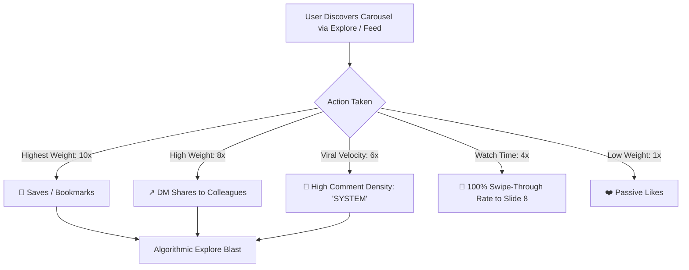

# 📈 @signhify.studio — Market Analysis & Viral Growth Architecture

> [!IMPORTANT]
> **Account Positioning**: **Piyush | Growth Systems** ([@signhify.studio](https://www.instagram.com/signhify.studio/))  
> **Niche**: Compound Growth Systems, Production AI Architecture, Automation Stacks, and Founder Execution.  
> **Target Audience**: Tech Founders, Indie Hackers, Growth Engineers, SaaS Operators, and Ambitious Builders.

---

## 1. Current Market Analysis: What Makes People Follow in 2025/2026?

In the tech, AI, and startup niches on Instagram, users are severely fatigued by generic AI news, surface-level ChatGPT prompts, and motivational platitudes. 

The accounts experiencing explosive organic growth (e.g., *Dan Murray-Terry, Justin Welsh, Linus Ekenstam, Tech Lead visuals*) succeed because of **Systemic Utility**.

### The Psychology of the Follow Decision
A user who swipes through your carousel asks one subconscious question before hitting **Follow**:
> *"If I follow this person, will my feed make me smarter, more efficient, and more profitable every week?"*

| Casual Impression | **High-Converting Follow Trigger** |
|---|---|
| "Here is some AI news I read on Twitter." | *"Here is the exact production architecture that cut our inference bill by 78%."* |
| Generic advice ("Focus on quality"). | Exact step-by-step checklists, code schemas, and decision matrices. |
| Asking passively for likes. | Offering an immediate tangible resource: *"Comment 'SYSTEM' for the Notion blueprint."* |
| Inconsistent, amateur visual templates. | Dark luxury, Linear/Apple-tier aesthetic with high visual contrast. |

---

## 2. The Algorithmic Ranking Formula (Instagram 2025/2026)

Instagram ranks carousels based on a strict hierarchy of user engagement signals:



1. **Saves (10x Multiplier)**: Carousels that function as **Reference Manuals** get saved at an 8–15% rate. Instagram flags high-save carousels as premium evergreen assets and continuously serves them to non-followers.
2. **Shares via DM (8x Multiplier)**: When a tech founder DMs a slide to their CTO or co-founder ("Look at slide 4"), Instagram detects high relational relevance.
3. **Comment-to-DM Trigger (Velocity)**: Asking users to comment a keyword (e.g. `SYSTEM`) creates rapid comment spikes within the first 60 minutes ("Golden Hour"), forcing the post into Explore feeds.

---

## 3. The 8-Slide Viral Architecture

Every carousel generated by Autogram is engineered around this psychological progression:

```
Slide 1 (Hook)        → Stop the scroll with an expensive mistake or bold counter-intuitive claim.
Slide 2 (Context)     → Expose why naive/standard approaches fail in production.
Slide 3 (Comparison)  → Side-by-side: Naive Approach vs Compound Growth System.
Slide 4 (Blueprint)   → Visual architecture diagram / pipeline flow (highest screenshot rate).
Slide 5 (Checklist)   → 3 actionable implementation rules for immediate execution.
Slide 6 (Benchmark)   → Concrete metrics, token savings, or speed improvements.
Slide 7 (Rule)        → The executive takeaway: "Architecture beats model selection."
Slide 8 (Terminal)    → The Follow Terminal with verified badge, Follow button, and Comment Lead Magnet.
```

---

## 4. Visual Transformation (Before vs After)

### Slide 8: Upgraded Follow Conversion Terminal
Autogram has been upgraded with a dedicated **Profile Follow Terminal** that directly converts readers into followers:


### Slide 1: High-Contrast Technical Hook


---

## 5. Technical Improvements Implemented in Autogram

1. **Brand Profile Sync ([`data/brand.json`](file:///d:/Autogram/data/brand.json))**:
   - Synced with your real Instagram identity: `Piyush | Growth Systems` ([@signhify.studio](https://www.instagram.com/signhify.studio/)).
   - Dynamic avatar badge (`S`) configured across all slide templates.
2. **Template Modernization ([`renderer/templates/cta.html`](file:///d:/Autogram/renderer/templates/cta.html))**:
   - Replaced generic placeholder button with a high-contrast **"Follow @signhify.studio ↗"** action terminal.
   - Added verified badge, profile card, and interactive engagement pills (`💾 Save`, `💬 Comment "SYSTEM"`, `↗ Share`).
   - Cleaned all 8 slide templates to dynamically pull `{{ brand.avatar_letter }}`.
3. **Caption & Growth Loop Engine ([`src/content/script_writer.py`](file:///d:/Autogram/src/content/script_writer.py))**:
   - Integrated the viral **Comment-to-DM hook**: *"Want the full architecture blueprint? Comment 'SYSTEM' below."*
   - Embedded the clear Follow value proposition: *"Follow @signhify.studio for battle-tested growth systems & AI architecture every week."*
   - Upgraded hashtag clusters with high-intent keywords (`#GrowthSystems`, `#SignhifyStudio`, `#AIWorkflows`, `#SystemDesign`, `#SaaSGrowth`).
